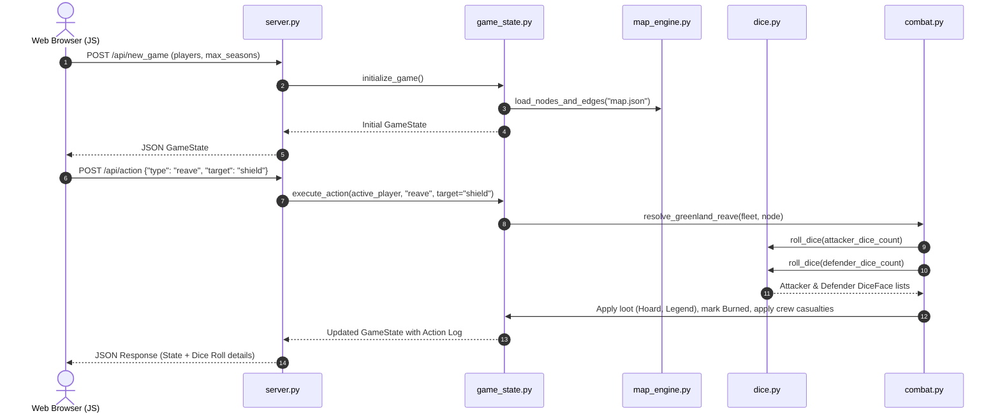

# MVP Phase 1: Core Tactical Engine & Map Reaving

## 1. Goal & Playable Deliverable

Phase 1 delivers the first **playable Web UI MVP** of **IRON PRICE: Kingsmoot**. Players can start a match (Pass-and-Play or Solo), view the complete map board in their browser, move ships across sea routes, muster crew at home ports, roll custom Ironborn dice to reave Green Lands, sack keeps for Hoard & Legend, mark burned keeps, track 3–5 seasons, and view final Legend scores.

---

## 2. Phase 1 Scope & Features

| Category | Features in Phase 1 |
|---|---|
| **Map & Geography** | • 22 nodes (5 Iron Isles, 5 Sea zones, 12 Green Lands) loaded from `map.json`.<br>• Adjacency graph with 27 edges connecting isles to bay, bay to sunset seas, and seas to coastal keeps.<br>• Node data: defense values, hoard loot, legend loot. |
| **Claimants & Setup** | • **Euron Crow's Eye**: Starts at Pyke (4 crew on *Silence*, 2 in reserve), 5 Hoard, 0 Legend, 0 Favor.<br>• **Victarion Iron Captain**: Starts at Great Wyk (4 crew on *Iron Victory*, 4 in reserve), 5 Hoard, 0 Legend, 0 Favor.<br>• **Asha Kraken's Daughter**: Starts at Harlaw (4 crew on *Black Wind*, 4 in reserve), 5 Hoard, 0 Legend, 0 Favor.<br>• 2 empty reaver ships per player at home port.<br>• Neutral crew (2) placed at Old Wyk and Orkmont (Defense 2). |
| **Turn & Action Loop** | • 3–5 Seasons configuration.<br>• 3 Turns per player per season (order: Asha $\rightarrow$ Euron $\rightarrow$ Victarion).<br>• 2 Actions per turn from the core action pool: **Sail**, **Muster**, **Reave Green Land**, **Pray**. |
| **Actions** | 1. **Sail**: Move a fleet from current node to an adjacent connected node (max speed = 2).<br>2. **Muster**: At a controlled port (Pyke/Harlaw/Great Wyk), spend 3 Hoard (2 Hoard at Great Wyk) $\rightarrow$ place +3 crew onto ship/port.<br>3. **Reave Green Land**: Attack an adjacent Green Land keep.<br>4. **Pray**: Discard an action point $\rightarrow$ gain +1 Favor on Drowned Favor track (0–7). |
| **Dice & Reaving Engine** | • 18 custom d6 dice pool: Kraken $\times 2$ (2 hits), Axe $\times 2$ (1 hit), Shield $\times 1$ (1 block), Eye $\times 1$ (Drowned trigger).<br>• Green Land Reave Formula:<br>  - Attacker rolls $\lceil \text{Crew} / 2 \rceil$ dice (max 6).<br>  - Defender rolls Green Land Defense dice (1–6).<br>  - Defender Hits = (Kraken $\times 2$ + Axe $\times 1$) - Attacker Shields.<br>  - Attacker Hits = (Kraken $\times 2$ + Axe $\times 1$) - Defender Shields.<br>  - If Attacker unblocked hits $\ge$ Keep Defense: Keep is sacked! Attacker gains stated Hoard + Legend, and the node is marked **Burned**.<br>  - Attacker takes crew casualties equal to Defender unblocked hits. |
| **Web UI** | • Interactive board rendering nodes, routes, ships, crew counters, and burned markers.<br>• Real-time player status panels (Hoard, Legend, Favor, Active player highlight).<br>• Action Control panel (Sail target dropdown, Muster button, Reave button, Pray button, End Turn button).<br>• Animated 3D/CSS Dice Tray showing roll outcomes (Krakens, Axes, Shields, Eyes).<br>• Live Game Log displaying turn events and battle outcomes. |

---

## 3. Game Engine Data Flow (`engine/`)



---

## 4. Web UI Component Layout

```
+---------------------------------------------------------------------------------------------------+
|  [IRON PRICE: Kingsmoot]   Season: 2 / 5   |   Round: Turn 1/3   |   Active: Euron Crow's Eye     |
+-------------------------------------------------------------+-------------------------------------+
|                                                             |  PLAYER DASHBOARDS                  |
|                                                             |  +--------------------------------+ |
|                     MAP BOARD (SVG/Canvas)                  |  | EURON CROW'S EYE (Active)      | |
|                                                             |  | Hoard: [5] | Legend: [2]       | |
|     (Harlaw) -------- (Ironman's Bay) ---- (Sunset Sea N)   |  | Favor: [1] | Crew: 6/15        | |
|        |                     |                     |        |  +--------------------------------+ |
|     (Pyke) ------------------+                     |        |  | VICTARION IRON CAPTAIN         | |
|        |                     |                     |        |  | Hoard: [3] | Legend: [1]       | |
|   (Great Wyk) ------- (Sunset Sea C)               |        |  | Favor: [0] | Crew: 8/15        | |
|        |                     |                     |        |  +--------------------------------+ |
|    (Orkmont)                 |                     |        |  | ASHA KRAKEN'S DAUGHTER         | |
|                              |                     |        |  | Hoard: [7] | Legend: [4]       | |
|                       (Sunset Sea S) -- [Shield]   |        |  | Favor: [2] | Crew: 7/15        | |
|                                                    |        +-----------------------------------+ |
|                                                    |  ACTION CONTROLS (2 Actions Remaining)      |
|                                                    |  [ Sail Fleet ]   -> [ Select Destination ]  |
|                                                    |  [ Muster Crew ]  -> (Costs 3 Hoard -> +3)   |
|                                                    |  [ Reave Land ]   -> [ Target: Shield Isles] |
|                                                    |  [ Pray Drowned ] -> (+1 Favor)              |
|                                                    |  [ End Turn ]                                |
+-------------------------------------------------------------+-------------------------------------+
|  DICE TRAY: [ Kraken (2) ] [ Axe (1) ] [ Shield (Block) ]   |  COMBAT & EVENT LOG                 |
|  Attacker Hits: 3 | Defender Hits: 1 | Outcome: VICTORY!    |  • Euron reaved Shield Isles! (+2H) |
+-------------------------------------------------------------+-------------------------------------+
```

---

## 5. API Request / Response Specs (Phase 1)

### Action 1: Sail
```json
// POST /api/action
{
  "action_type": "sail",
  "ship_id": "euron_flagship",
  "from_node": "pyke",
  "to_node": "bay"
}
```

### Action 2: Muster
```json
// POST /api/action
{
  "action_type": "muster",
  "node_id": "pyke",
  "ship_id": "euron_flagship"
}
```

### Action 3: Reave
```json
// POST /api/action
{
  "action_type": "reave",
  "ship_id": "euron_flagship",
  "target_node": "shield"
}
```

---

## 6. Phase 1 Acceptance Criteria

1. **Server Launch**: Running `python server.py` starts the HTTP server on `http://localhost:8000`.
2. **Browser Loading**: Navigating to `http://localhost:8000` renders the 22-node map board, 3 player dashboards, action panel, dice tray, and log without JS console errors.
3. **Movement**: Ships can only move along valid edges defined in `map.json`.
4. **Mustering**: Players can spend 3 Hoard (2 Hoard at Great Wyk) to add 3 crew to their port/ships.
5. **Reaving & Dice Mechanics**: Attacking a Green Land calculates dice counts based on crew, rolls the 18 custom dice faces, computes net hits, applies damage to crew, awards Hoard & Legend, and marks the node as Burned.
6. **Season Progression**: After all 3 players complete 3 turns of 2 actions each, the season advances. Reaching the final season ends the game and announces the winner with highest Legend.
