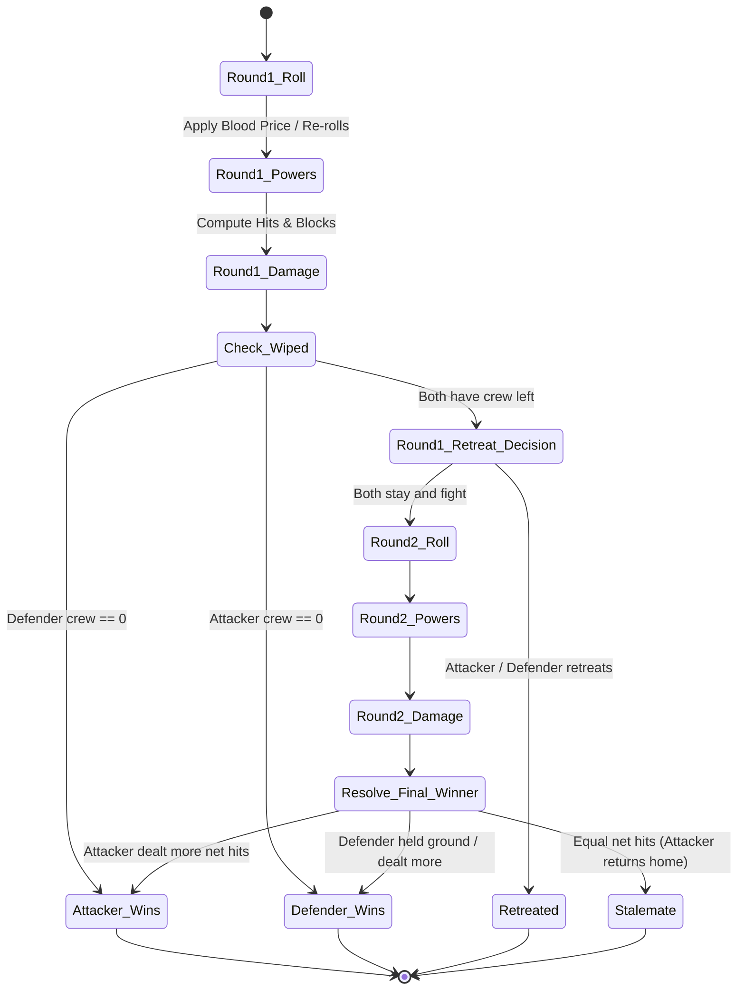

# MVP Phase 2: Fleet Battles, Favor Miracles & Sea Hazards

## 1. Goal & Playable Deliverable

Phase 2 builds upon the Phase 1 tactical foundation by introducing **PvP naval combat** between rival Ironborn claimants, **asymmetric Flagships**, **Faction powers**, the **Drowned Favor track (0–7)** with game-changing miracles, the treacherous **Storm Belt**, and the **no-elimination respawn** rule.

At this phase, players can sail into contested waters, engage rival fleets in an animated 2-round battle arena, invoke Drowned God miracles, weather violent sea storms, and experience the full depth of faction asymmetry.

---

## 2. Phase 2 Scope & Features

| Category | Features in Phase 2 |
|---|---|
| **Rival Fleet Combat** | • Initiated when a fleet moves into a node occupied by another player's ship or takes the **Reave** action against a rival fleet.<br>• **2-Round Naval Battle Resolution**:<br>  - **Dice Pool**: Attacker and Defender each roll $\lceil \text{Crew} / 2 \rceil$ dice + ship/power bonuses (capped at 6 dice).<br>  - **Hit & Block Resolution**: Krakens (2 hits), Axes (1 hit), Shields (block 1 hit), Eyes (Favor trigger / Blood Price).<br>  - Unblocked hits inflict 1-for-1 crew casualties on the opposing fleet.<br>  - **Retreat Choice**: After Round 1, Asha can retreat for free; Euron and Victarion can retreat by sacrificing 1 crew as rearguard.<br>  - **Looting**: Sinking/wiping an enemy fleet transfers 50% of their carried Hoard to the victor and awards +1 Legend. |
| **Flagship Asymmetry** | • **Silence** (Euron): Base speed = 3. *Silent Trait*: Defenders roll -1 die on the first raid against Euron each season. Immune to cargo steal.<br>• **Iron Victory** (Victarion): Max crew capacity = 6 (vs standard 4). Movement is reduced to 1 when fully loaded (5–6 crew).<br>• **Black Wind** (Asha): Base speed = 2. Ignores Storm Belt entry hazard rolls. May Sail and Reave in the same action turn. Free retreat after battle round 1. |
| **Faction Innate Powers** | • **Blood Price** (Euron): Once per battle, Euron can re-roll any number of his dice. Each **Eye** rolled grants +1 Favor but costs 1 crew.<br>• **Iron Captain** (Victarion): +1 Raid Die in every battle and raid. Axes count double (2 hits each) when fighting in home waters (*Ironman's Bay*).<br>• **Kraken's Daughter** (Asha): Win a raid without losing any crew $\rightarrow$ draw +1 bonus card (or gain +1 Hoard in Phase 2). Free battle retreat after round 1 without crew sacrifice. |
| **Drowned Favor Miracles** | • Favor track from 0 to 7. Gained through praying, losing crew in battle (1 Favor per 2 crew lost), or rolling Eyes.<br>• Spendable at any time during active player's turn:<br>  - **2 Favor — Re-roll**: Re-roll any number of your rolled dice.<br>  - **4 Favor — Call Storm**: Target an enemy fleet in an adjacent sea zone $\rightarrow$ they lose 1 crew and are pushed back 1 node.<br>  - **6 Favor — Auto-Win**: Instantly win one battle round (counts as 5 unblockable hits). |
| **Storm Belt Hazards** | • When any fleet (except Asha's *Black Wind*) enters the `storm` node (Storm Belt):<br>  - Roll 1 Storm Die:<br>    - **Kraken / Axe**: Safe passage.<br>    - **Shield**: Pushed back to the origin node.<br>    - **Eye**: Lose 1 crew to the depths, gain +1 Favor. |
| **No-Elimination Respawn** | • If a claimant's ships are all sunk or completely stripped of crew, they **respawn at their home port** at the start of their next turn with 1 Longship + 3 Crew for free.<br>• Defeat fueling miracles: 1 Favor gained per 2 crew lost in combat. |
| **Web UI Additions** | • **Modal Battle Arena**: Dedicated popup overlay displaying attacker ship vs defender ship, active round (1 of 2), live dice rolls, hit tallies, power toggles (*Blood Price* re-roll), and Retreat/Fight buttons.<br>• **Favor Miracles Panel**: Interactive buttons for 2, 4, and 6 Favor miracles with valid target highlighters on the map.<br>• **Storm Belt Visual Warning**: Animated storm clouds and wind particles over the Storm Belt on the map board. |

---

## 3. Battle Arena State Machine (`engine/combat.py`)



---

## 4. Web UI Battle Arena Wireframe

```
+---------------------------------------------------------------------------------------------------+
|                                 NAVAL BATTLE: IRONMAN'S BAY (Round 1/2)                           |
+---------------------------------------------------------------------------------------------------+
|  ATTACKER: EURON CROW'S EYE (Silence)          |  DEFENDER: VICTARION (Iron Victory)              |
|  Crew: 4/4  |  Dice Count: 3                   |  Crew: 6/6  |  Dice Count: 4 (+1 Iron Captain)   |
|                                                |                                                  |
|  Dice Rolled:                                  |  Dice Rolled:                                    |
|  [ KRAKEN (2) ] [ AXE (1) ] [ EYE (0) ]        |  [ AXE (1) ] [ AXE (1) ] [ SHIELD (B) ] [ EYE ]  |
|                                                |                                                  |
|  Raw Hits: 3  |  Blocks: 0                     |  Raw Hits: 2  |  Blocks: 1                       |
|  Net Damage to Defender: 2 Crew                |  Net Damage to Attacker: 2 Crew                  |
|                                                |                                                  |
|  [ Euron Power: Blood Price (Re-roll) ]        |  [ Victarion: Axes x2 on Ironman's Bay! ]        |
+------------------------------------------------+--------------------------------------------------+
|  FAVOR SPENDING:                                                                                  |
|  [ Spend 2 Favor: Re-roll 1 Die ]    [ Spend 6 Favor: Miracle Auto-Win (5 Hits) ]                 |
+---------------------------------------------------------------------------------------------------+
|  ROUND 1 RESOLUTION:                                                                              |
|  [ Continue to Round 2 ]          [ Retreat Fleet (Free for Asha / 1 Crew Sacrifice for Euron) ]  |
+---------------------------------------------------------------------------------------------------+
```

---

## 5. API Request / Response Specs (Phase 2)

### Action: Trigger Fleet Battle
```json
// POST /api/action
{
  "action_type": "battle_round",
  "battle_id": "b_1234",
  "use_blood_price": true,
  "reroll_dice_indices": [2],
  "retreat": false
}
```

### Action: Cast Favor Miracle
```json
// POST /api/action
{
  "action_type": "favor_miracle",
  "miracle_cost": 4,
  "target_faction": "Victarion",
  "target_node": "seaS"
}
```

---

## 6. Phase 2 Acceptance Criteria

1. **Naval Skirmishes**: Moving a ship into a node with an opponent launches the 2-Round Battle Arena Modal.
2. **Flagship Mechanics**:
   - Euron's *Silence* moves 3 nodes and applies -1 defender die on first raid.
   - Victarion's *Iron Victory* carries 6 crew and moves 1 space when loaded with 5+ crew.
   - Asha's *Black Wind* ignores Storm Belt rolls and retreats for 0 crew loss.
3. **Innate Faction Abilities**: Euron can re-roll with *Blood Price*, Victarion gains +1 combat die and double axes in Ironman's Bay.
4. **Favor Miracles**: Players can spend 2, 4, or 6 Favor to execute re-rolls, storm knockbacks, or auto-wins.
5. **Storm Belt**: Moving into the `storm` node triggers an animated Storm roll with accurate pass/pushback/casualty outcomes.
6. **No Elimination**: A player wiped in combat respawns with 1 ship + 3 crew at their starting port.
