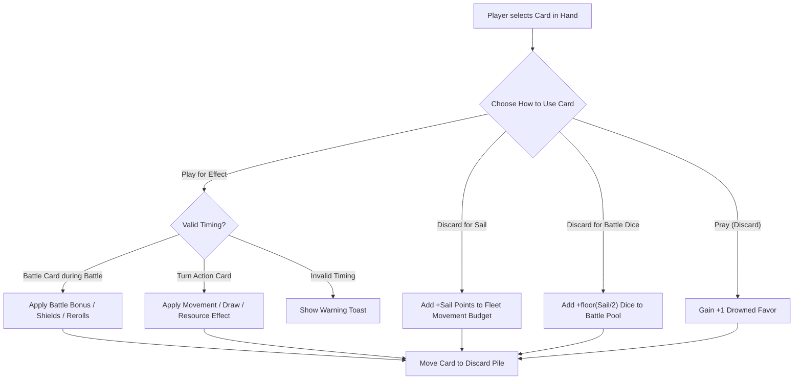

# MVP Phase 3: Tide Deck, Faction Cards & Dual-Use Hand Management

## 1. Goal & Playable Deliverable

Phase 3 introduces the full **90-Card Strategy Engine** (60 Tide Cards + 30 Faction Cards) and the core **Dual-Use Hand Management** system of *IRON PRICE: Kingsmoot*. 

Players now manage an interactive card hand at the bottom of the screen. Every card presents a critical tactical decision: **Discard for Sail movement / Combat Dice** vs **Play for unique Event/Battle Effects**. Phase 3 also incorporates port draw bonuses, in-battle card plays, and the **Pillage & Repair** actions for burned territories.

---

## 2. Phase 3 Scope & Features

| Category | Features in Phase 3 |
|---|---|
| **Shared Tide Deck (60 Cards)** | • 15 unique card types $\times$ 4 copies each.<br>• Dual-use mechanics:<br>  - **Sail Value (1–3)**: Discard to grant +1 movement per Sail point to a fleet this turn, OR +1 combat die per 2 Sail points in battle.<br>  - **Effect**: Follow unique card rules text, then discard.<br>• Full card suite implemented:<br>  1. *Boarding Party* (Sail 1): +2 Raid Dice when attacking.<br>  2. *Shield Wall* (Sail 1): Block 2 hits this round.<br>  3. *Full Sail* (Sail 3): +2 movement to one fleet; draw 1 card if ending at sea.<br>  4. *Drowned Blessing* (Sail 1): Cancel all rolled Eyes $\rightarrow$ gain +1 Favor per Eye.<br>  5. *Pay the Iron Price* (Sail 1): Discard 2 Hoard $\rightarrow$ place +3 crew on attacking ship.<br>  6. *We Do Not Sow* (Sail 2): Double Hoard taken if raid won; gain 0 Legend.<br>  7. *Thralls Take* (Sail 2): Steal 1 enemy crew as thrall upon winning raid.<br>  8. *Salt Wife* (Sail 1): +1 hand size until end of season; draw 1 card immediately.<br>  9. *Storm Warning* (Sail 2): Fleets ignore Storm Belt rolls this turn; Sail +1.<br>  10. *Night Raid* (Sail 2): +3 dice on first Reave this season; defender rolls -1 die.<br>  11. *Pillage* (Sail 2): Loot a Burned land you occupy without fighting.<br>  12. *Ironborn Resolve* (Sail 1): Ignore 2 hits dealt this round.<br>  13. *Storm God's Wrath* (Sail 1): All fleets in target sea zone roll Storm die.<br>  14. *Drowned Priest* (Sail 1): +2 Drowned Favor (+3 if at Old Wyk).<br>  15. *War Horn* (Sail 2): +1 die to every battle fought this turn. |
| **Faction Decks (30 Cards)** | • 10 unique asymmetric cards per claimant:<br>  - **Euron** (Dice Sorcery & Chaos): *Silence Ambush*, *Crow's Eye*, *Dragon Horn*, *Warlock Shade*, *Mute Crew*, *Blood Sacrifice*, *Stormcaller*, *Euron's Madness*, *Qarth Treasure*, *Nightmare Fleet*.<br>  - **Victarion** (Raw Combat & Axes): *Iron Victory Charge*, *Shield Breaker*, *Drowned Baptism*, *Iron Fleet Ram*, *Victarion's Fury*, *Muster the Fleet*, *Boarding Axe*, *Sea Bitch Tribute*, *Drowned God's Fist*, *Unbowed*.<br>  - **Asha** (Mobility, Stealth & Steal): *Parley*, *Black Wind Dash*, *Smuggler's Cove*, *Kraken's Daughter*, *Reading the Tide*, *Hit and Run*, *Harlaw Alliance*, *Sneak Ashore*, *Ransom*, *Queen's Gambit*. |
| **Hand Management & Draw Cycle** | • Hand limits: Euron (5), Victarion (4), Asha (6).<br>• Season Start: All players draw from the Tide Deck up to their hand limit.<br>• Port Control: Controlling **Pyke** (Euron's home) or **Harlaw** (Asha's home) awards +1 bonus card draw at Season start.<br>• Faction Cards: Players start with 2 faction cards and draw additional faction cards at Season 2 and Season 4. |
| **Pillage & Repair Actions** | • **Pillage**: Occupying a Burned Green Land $\rightarrow$ gain its reduced loot (Hoard - 1) without initiating combat.<br>• **Repair**: Occupying a Burned Green Land $\rightarrow$ pay 2 Hoard to flip the territory fresh (un-burned) for future full reaves. |
| **In-Battle Card Plays** | • In each combat round (Rival battle or Green Land reave), both attacker and defender may play **up to 1 card** (or 1 Tide + 1 Faction card if different).<br>• Cards can be played for their tactical effect or burned for bonus combat dice. |
| **Web UI Additions** | • **Card Hand Dock**: Expandable dock at the bottom of the screen displaying beautifully styled card frames with Sail cost, card art/icons, and effect text.<br>• **Dual-Use Action Selector**: Clicking a card opens a contextual modal: `[ Play Effect ]` vs `[ Discard for +N Sail / +N Dice ]` vs `[ Pray: Discard for +1 Favor ]`.<br>• **In-Battle Hand Selector**: Seamlessly integrated card picker inside the Battle Arena modal.<br>• **Deck & Discard Inspector**: View remaining cards in deck and inspect the discard graveyard. |

---

## 3. Dual-Use Card Resolution Flow



---

## 4. Web UI Card Component Layout

```
+---------------------------------------------------------------------------------------------------+
|  [ MAP BOARD & DASHBOARDS ]                                                                       |
+---------------------------------------------------------------------------------------------------+
|  YOUR HAND (Euron Crow's Eye — 4 / 5 Cards)                        [ Draw Pile: 48 ] [ Discard: 8 ]|
|  +-------------------+  +-------------------+  +-------------------+  +-------------------+       |
|  | [SAIL: 3]         |  | [SAIL: 1]         |  | [SAIL: 2]         |  | [SAIL: 1]         |       |
|  | FULL SAIL         |  | BOARDING PARTY    |  | DRAGON HORN       |  | CROWS EYE         |       |
|  | (Tide Card)       |  | (Tide Card)       |  | (Faction: Euron)  |  | (Faction: Euron)  |       |
|  |                   |  |                   |  |                   |  |                   |       |
|  | +2 movement to    |  | +2 Raid Dice      |  | Force enemy fleet |  | Re-roll any dice. |       |
|  | one fleet this    |  | when attacking.   |  | to lose 2 crew OR |  | Each EYE grants   |       |
|  | turn. Draw 1 card |  | Discard after     |  | retreat.          |  | +1 Favor.         |       |
|  | if ending at sea. |  | battle.           |  | Costs 2 Favor.    |  |                   |       |
|  |                   |  |                   |  |                   |  |                   |       |
|  | [ Play ] [ Sail ] |  | [ Play ] [ Dice ] |  | [ Play ] [ Sail ] |  | [ Play ] [ Dice ] |       |
|  +-------------------+  +-------------------+  +-------------------+  +-------------------+       |
+---------------------------------------------------------------------------------------------------+
```

---

## 5. API Request / Response Specs (Phase 3)

### Action 1: Play Card for Effect
```json
// POST /api/action
{
  "action_type": "play_card",
  "card_id": "tide_full_sail_01",
  "target_ship_id": "euron_flagship"
}
```

### Action 2: Discard Card for Sail Boost
```json
// POST /api/action
{
  "action_type": "discard_for_sail",
  "card_id": "tide_full_sail_01",
  "target_ship_id": "euron_flagship"
}
```

### Action 3: Play Card in Battle Round
```json
// POST /api/action
{
  "action_type": "battle_play_card",
  "battle_id": "b_1234",
  "card_id": "tide_boarding_party_02"
}
```

### Action 4: Pillage / Repair
```json
// POST /api/action
{
  "action_type": "pillage", // or "repair"
  "node_id": "shield",
  "ship_id": "euron_flagship"
}
```

---

## 6. Phase 3 Acceptance Criteria

1. **Card Deck Integrity**: All 60 Tide cards and 30 Faction cards are correctly initialized, shuffled, and dealt according to player hand limits.
2. **Dual-Use Functionality**: Discarding cards for Sail increases fleet movement; discarding for combat adds bonus dice; playing for effect correctly triggers the corresponding logic.
3. **Port Bonuses**: Controlling Pyke and Harlaw at Season start correctly triggers the +1 bonus card draw.
4. **Battle Card Phase**: Players can play up to 1 card per combat round to modify attack dice, grant shields, or inflict special status.
5. **Pillage & Repair**: Players can pillage burned lands for reduced loot or spend 2 Hoard to repair them.
6. **UI Hand Dock**: The web client renders high-resolution card frames with responsive tooltips and dual-use action triggers.
