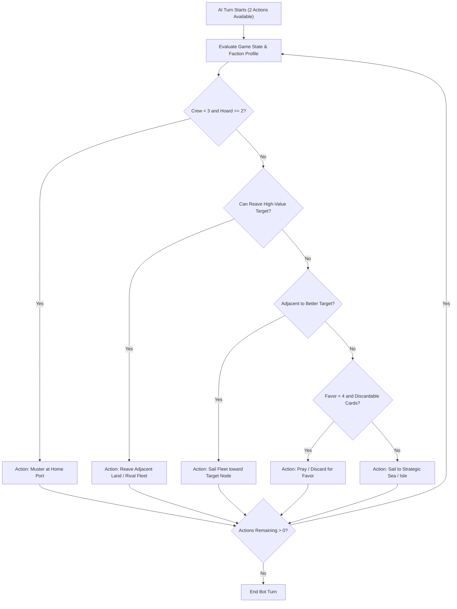

# MVP Phase 4: Full Kingsmoot Campaign, Advanced AI & Polish

## 1. Goal & Playable Deliverable

Phase 4 delivers the **complete, finalized commercial-grade experience** for **IRON PRICE: Kingsmoot**. 

This includes the full **Season End Phase** (Control scoring, Greed bonuses, Wrath of the Storm God, Bounty on the leader), the grand **Final Kingsmoot Coronation Ceremony** after Season 5, **sophisticated heuristic AI bots** tailored to each claimant's unique personality and strengths, immersive ASoIaF audio-visual styling, an integrated interactive rulebook viewer, and multi-mode support (Solo vs AI, Pass-and-Play, and 3-AI Spectator simulation).

---

## 2. Phase 4 Scope & Features

| Category | Features in Phase 4 |
|---|---|
| **Complete Season End Phase** | Executed automatically at the conclusion of all player turns in Seasons 1 through 5:<br>1. **Refresh Lands**: Refresh up to 2 Burned Green Lands (flip fresh for new raids).<br>2. **Control Scoring**: +1 Legend per Iron Isle occupied (most crew wins ties $\rightarrow$ most ships breaks tie).<br>3. **Special Isles**:<br>   - **Old Wyk** holder: +1 Favor and +1 Legend.<br>   - **Orkmont** holder: +2 Hoard.<br>4. **Greed**: Player holding strictly the most Hoard gains **+2 Legend** (in a tie, nobody scores).<br>5. **Wrath of the Storm God**: The current Legend leader loses 1 crew on every ship left at sea (ships in port are safe).<br>6. **Bounty Placement**: A Bounty marker is placed on the Legend leader (raiding the leader awards **+1 bonus Hoard**).<br>7. **Hand Cleanup**: Discard down to faction hand size limit. |
| **Final Kingsmoot Ceremony** | Triggered immediately at the conclusion of Season 5. Computes final Kingsmoot bonuses and crowns the King of Salt and Rock:<br>• **Base Legend**: Total accumulated from Green Land reaves and Isle control.<br>• **Favor of the Drowned God**: **+3 Legend** to the player with the most accumulated Favor.<br>• **Reaver's Glory**: **+2 Legend** to the player with the most successful raids.<br>• **Hoard Conversion**: **+1 Legend per 5 Hoard banked** ($\lfloor \text{Hoard} / 5 \rfloor$).<br>• **Winner Proclamation**: Grand coronation screen displaying awards, medals, and game trajectory statistics. |
| **Claimant Heuristic AI Engines** | • **Euron Bot (The Sorcerer)**:<br>  - Targets high-value wealthy keeps (Oldtown, Casterly Rock, Winterfell).<br>  - Actively uses *Blood Price* to re-roll for Krakens.<br>  - Spends Favor aggressively on 4-Favor storms and 6-Favor auto-wins.<br>• **Victarion Bot (The Iron Captain)**:<br>  - Seeks battlefield superiority; commands Ironman's Bay for double Axe bonuses.<br>  - Musters heavy crew at Great Wyk (cheap 2 Hoard muster).<br>  - Engages rival fleets aggressively with 6-crew *Iron Victory*.<br>• **Asha Bot (Kraken's Daughter)**:<br>  - Prioritizes rapid hit-and-run raids on coastal isles (Shield Isles, Fair Isle, Arbor).<br>  - Hoards high-combo card hands and leverages card draw velocity.<br>  - Retreats early to preserve crew and steals Hoard via *Parley*. |
| **Game Modes** | 1. **Solo Player**: User plays 1 claimant vs 2 AI bots.<br>2. **Pass & Play**: 3 local human players on one device.<br>3. **Spectator Mode**: 3 AI bots play against each other with variable speed controls (1x, 2x, instant). |
| **Audio & Visual Polish** | • Thematic dark iron, ocean foam, weathered parchment, and brass badge aesthetics.<br>• Sound Effects: Dice shaking and rolling, sword clashes, ocean waves, horn fanfare on victory (with mute button).<br>• Interactive in-game Rulebook viewer modal.<br>• Game state persistence (Save / Load / Restart). |

---

## 3. Kingsmoot Scoring Formula & Breakdown

$$\text{Final Legend} = \text{Base Legend} + \text{Kingsmoot Bonus}$$

$$\text{Kingsmoot Bonus} = 3 \cdot \mathbb{I}_{\text{Most Favor}} + 2 \cdot \mathbb{I}_{\text{Most Raids}} + \left\lfloor \frac{\text{Hoard}}{5} \right\rfloor$$

```
+---------------------------------------------------------------------------------------------------+
|                                 THE KINGSMOOT ON OLD WYK                                          |
|                              "WHAT IS DEAD MAY NEVER DIE!"                                        |
+---------------------------------------------------------------------------------------------------+
|  CLAIMANT           | SACKING | ISLES | FAVOR BONUS | RAIDS BONUS | HOARD BONUS | TOTAL LEGEND    |
|---------------------|---------|-------|-------------|-------------|-------------|-----------------|
|  EURON CROW'S EYE   |   8     |   4   |   +3 (Max)  |    +0       |   +2 (12g)  |   17 ★ WINNER   |
|  VICTARION          |   6     |   5   |   +0        |    +2 (Max) |   +1 (7g)   |   14            |
|  ASHA               |   7     |   3   |   +0        |    +0       |   +3 (16g)  |   13            |
+---------------------------------------------------------------------------------------------------+
|                           [ Restart Game ]       [ View Statistics ]                              |
+---------------------------------------------------------------------------------------------------+
```

---

## 4. AI Decision-Making Architecture (`engine/ai.py`)



---

## 5. API Request / Response Specs (Phase 4)

### Action: Step AI Bot
```json
// POST /api/ai_step
{}
```
**Response**:
```json
{
  "status": "success",
  "action_executed": {
    "faction": "Euron",
    "action_type": "reave",
    "target": "oldtown",
    "details": "Euron rolled 3 dice and sacked Oldtown for 4 Hoard and 2 Legend!"
  },
  "state": { ... }
}
```

---

## 6. Phase 4 Acceptance Criteria

1. **Season End Automation**: Correctly scores control, awards Old Wyk/Orkmont bonuses, grants Greed (+2 Legend), applies Wrath crew loss to ships at sea, places Bounty on the leader, and refreshes 2 burned keeps.
2. **Kingsmoot Finale**: Correctly calculates and displays the 4-part scoring breakdown (+3 Favor, +2 Raids, +1 per 5 Hoard) and crowns the winner.
3. **AI Bots**: Euron, Victarion, and Asha bots execute valid, competitive, lore-aligned moves without stalling or generating invalid actions.
4. **Spectator & Solo Modes**: Solo matches allow smooth play against 2 bots with auto-stepping or turn animations; Spectator mode runs 3 bots to completion.
5. **Full Polish**: Sound effects trigger appropriately with a working mute button; UI layout is responsive and cleanly themed.
